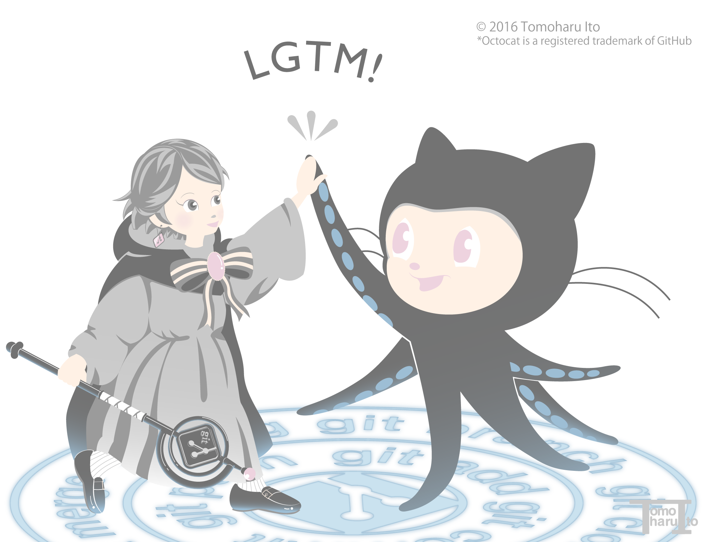

# [TREE OF LIFE](https://tomoharuito.github.io/)

## Overview
TREE OF LIFE is a web site for exhibiting Tomoharu Ito's artwork.
### Description

This repository is for storing Tomoharu Ito's web site's source code.  
Please note that it is not used for supplying any software or plug-ins.

## Thank you message:
I would like to thank all the people who taught me how to write code through web sites and books.  
Thanks to their generous knowledge sharing, I was able to create my own page even as a complete novice.

## LICENSE
**&copy; 2017 TomoharuIto All rights reserved**

**No License**  
Tomoharu Ito owns the rights for all source code, image files, illustrations, etc. stored in this repository.  
These must not be used, distributed, reprinted, used commercially, modified, etc. without obtaining prior permission.  
＊This does not apply to any plug-in files, fonts, or any other material not created by Tomoharu Ito as listed below.  All source code rights belong to their creator or rights owner.  
Please refer to each respective site for more information on license, etc. We would like to take this opportunity to thank the creators of all these plug-ins.
* [jQuery](https://github.com/jquery/jquery)
* [js-cookie](https://github.com/js-cookie/js-cookie)
* [Raphaёl](https://github.com/DmitryBaranovskiy/raphael)
* [Normalize.css](https://github.com/necolas/normalize.css)
* [Google Analytics](https://www.google.com/intl/ja_JP/analytics/)
* [cdnjs](https://github.com/cdnjs/cdnjs)
* [octocat](https://octodex.github.com/faq.html)
